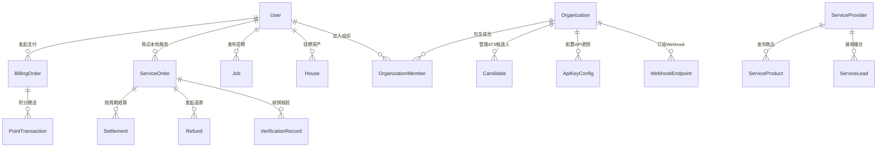

# 杨林生活网 (iyanglin.com) 数据库说明手册

## 1. 数据库运行环境与基础配置

| 配置项 | 规格 / 设定 | 说明 |
| :--- | :--- | :--- |
| **数据库引擎** | PostgreSQL 15 (Alpine Linux) | 基于 Docker 容器化编排运行 (`vasto-postgres`) |
| **持久化目录** | `/var/lib/docker/volumes/postgres_data/_data` | 主机持久化挂载卷 |
| **连接池管理** | Prisma ORM 5.x 客户端连接池 | 默认连接池容量 10，闲置超时 10s |
| **字符集与编码** | `UTF8` / `zh_CN.UTF-8` | 全量支持 Emoji 表情、富文本特殊符号与多语言 |
| **主键生成策略** | `cuid()` (Collision-resistant unique identifier) | 全局高并发无冲突分布式字符串主键，杜绝整型递增撞库与爬虫遍历风险 |
| **标识符规范** | PascalCase 模型名 + camelCase 属性名 | 原生 SQL 查询时必须对表名添加双引号 (`"User"`, `"Job"`, `"BillingOrder"`) |
| **业务模型总数** | 119 个数据模型 | 涵盖 P0 至 P8 全域业务模块 |
| **强类型枚举** | 7 个原生枚举类型 | `Role`, `ContentStatus`, `OrderStatus`, `IndustrialPropertyType`, `IndustrialTransactionType`, `IndustrialStatus`, `IndustrialVerifiedLevel` |

---

## 2. 核心数据设计三大铁律

### 铁律一：金额全部采用「分」(Cents/Int) 整数存储
- **禁止使用浮点数 (Float/Double)** 存储任何商业交易、用户支付、退款、佣金分成或商户结算资金。
- **涉及核心模型与字段**：
  - `BillingPlan.priceCents`: 会员计划或置顶服务标准售价 (分)
  - `BillingOrder.amountCents`: 订单实付人民币总额 (分)
  - `ServiceOrder.totalCents`, `payCents`, `discountCents`, `commissionCents`: 订单拆解计费金额 (分)
  - `Refund.refundAmountCents`: 实际退款出资金额 (分)
  - `Settlement.amountCents`, `platformFeeCents`, `taxCents`: 平台打款与手续费 (分)
  - `ChargeConfig` 及 `SubCategoryPricing`: 每日置顶单价 (`pinnedPriceDaily`)、加红单价 (`highlightPriceDaily`)、刷新单价 (`refreshPriceOnce`)、分类发帖单价 (`unitPrice`) 全部以分为基准。
- **金额防篡改约束**：前端收银台页面仅传递业务套餐 ID (`planId`) 或优惠券 ID (`couponId`)，**绝对不允许前端上送金额数值**。后端 API 查询数据库基准价并计算优惠后生成预支付交易，彻底消除刷单与改价风险。

### 铁律二：核心财务与履约数据严禁物理删除
- **物理删除绝对封杀**：系统内严禁对 `BillingOrder`、`ServiceOrder`、`Refund`、`Settlement`、`OperationLog`、`BusinessEvent`、`AgentActionLog`、`OrganizationAuditLog` 执行 `prisma.delete`。
- **状态流转机制替代删除**：业务终止或作废一律通过状态机流转为 `CANCELLED`、`CLOSED` 或 `REFUNDED`。
- **账务对冲机制**：若发生金额差错或异常掉单，必须通过“创建对冲退款单”或“补充结算流水”进行账目修正，确保资金链每一分钱均有完整的双向凭证记录。

### 铁律三：多租户与组织维度强隔离 (`organizationId`)
- 凡属于企业 SaaS、商户工作台或招聘 ATS 范畴的数据，必须包含 `organizationId` 字段。
- 关键模型涵盖：`OrganizationMember`、`OrganizationInvite`、`Candidate`、`CandidateInterview`、`LeadFollowUp`、`OrganizationTask`、`ApiKeyConfig`、`WebhookEndpoint`。
- 业务查询层必须强制绑定当前登录用户的所属组织：`where: { organizationId: currentOrgId }`。一旦捕获跨租户非法嗅探行为，接口层直接拦截并阻断，返回 HTTP 403 Forbidden。

---

## 3. 119 个数据模型全域分类索引

```
119 Models
├── 一、统一用户与多端认证 (6)
│   ├── User (用户主表)
│   ├── AuthAccount (多凭证账号)
│   ├── WechatAccount (微信绑定账号)
│   ├── LoginLog (登录审计日志)
│   ├── WechatFollower (服务号粉丝)
│   └── WechatIdentity (多端统一身份)
├── 二、本地分类与同城生活 (17)
│   ├── Job (求职招聘岗位)
│   ├── Resume (求职个人简历)
│   ├── JobApplication (应聘投递记录)
│   ├── House (租房二手房源)
│   ├── Shop (实体店铺名录)
│   ├── Listing (二手闲置便民)
│   ├── IndustrialProperty (工业厂房与产业用地)
│   ├── DatingProfile (杨林同城相亲嘉宾)
│   ├── Event (同城线下活动)
│   ├── EventSignup (活动报名清单)
│   ├── Post (社区动态论坛帖子)
│   ├── PostComment (帖子互动评论)
│   ├── PostLike (点赞记录)
│   ├── Topic (论坛话题分类)
│   ├── Article (本地新闻资讯)
│   ├── PhoneCategory (便民电话分组)
│   └── PhoneEntry (便民黄页电话条目)
├── 三、社交互动与安全风控 (7)
│   ├── Favorite (全站收藏夹)
│   ├── Notification (统一站内信通知)
│   ├── Report (用户违规举报工单)
│   ├── SearchLog (搜索历史与缺口日志)
│   ├── Review (服务真实评价)
│   ├── ContactPurchase (联系方式付费解锁)
│   └── ContactEvent (拨打电话点击漏斗事件)
├── 四、商业变现与虚拟资产 (13)
│   ├── BillingPlan (商业充值/置顶套餐)
│   ├── BillingSetting (收银台参数配置)
│   ├── BillingOrder (商业交易订单)
│   ├── ChargeConfig (全站分类发布计费规则)
│   ├── MemberVipPackage (VIP会员权益包)
│   ├── UserMembership (用户VIP有效状态)
│   ├── SubCategoryPricing (细分二级类目差异化定价)
│   ├── CoinWallet (用户金币余额钱包)
│   ├── CoinTransaction (金币流水明细)
│   ├── PointAccount (用户积分账户)
│   ├── PointTransaction (积分收支流水)
│   ├── ListingPromotion (信息置顶推广排期)
│   └── PromotionPackage (商业推广组合包)
├── 五、本地服务履约与结算 (14)
│   ├── ServiceProvider (入驻师傅与商户主体)
│   ├── ServiceProduct (团购/到家服务商品)
│   ├── ServiceRequest (用户即时找师傅需求单)
│   ├── ServiceLead (需求撮合分派线索)
│   ├── ServiceOrder (服务交易履约订单)
│   ├── Settlement (商户周期结算账单)
│   ├── Refund (交易退款单据)
│   ├── AfterSale (售后服务纠纷工单)
│   ├── VerificationRecord (券码扫码核销凭证)
│   ├── FollowProvider (商户关注关系)
│   ├── MerchantCampaign (商户自主营销活动)
│   ├── UserPreference (用户服务偏好特征)
│   ├── ProviderCustomerNote (商家客户私密CRM备忘)
│   └── UserAddress (用户同城上门服务地址)
├── 六、营销中心与卡券 (2)
│   ├── ServiceCoupon (平台/商户优惠券模板)
│   └── UserCoupon (用户领取的优惠券实例)
├── 七、系统参数与中台基座 (20)
│   ├── SystemSetting (全站系统参数 KV)
│   ├── IntegrationConfig (第三方短信/支付接口配置)
│   ├── FeatureFlag (灰度功能特性开关)
│   ├── Permission (系统原子权限项)
│   ├── RolePermission (角色-权限关联)
│   ├── AdminMenu (后台动态导航菜单)
│   ├── DictionaryType (数据字典类型定义)
│   ├── DictionaryItem (数据字典枚举条目)
│   ├── Region (杨林及嵩明行政区划)
│   ├── Tag (全站通用标签库)
│   ├── AdPlacement (广告展示位管理)
│   ├── Advertisement (广告物料与排期)
│   ├── Recommendation (跨频道推荐策略与规则)
│   ├── MediaFile (本地/对象存储媒体资源)
│   ├── MediaReference (图片与视频引用关系)
│   ├── MessageCampaign (站内信批量推送计划)
│   ├── ScheduledTask (系统后台 Cron 定时任务)
│   ├── TaskRun (定时任务执行审计流水)
│   ├── OperationLog (管理员后台操作日志)
│   └── AnalyticsEvent (埋点行为日志)
├── 八、微信生态与私域运营 (11)
│   ├── WechatQrCode (服务号带参推广活码)
│   ├── WechatUserTag (微信粉丝用户标签)
│   ├── WechatTagRelation (粉丝-标签映射)
│   ├── WechatUserEvent (微信事件日志)
│   ├── WechatCustomerConversation (微信客服交互会话)
│   ├── BusinessLead (私域获客转化线索)
│   ├── WechatNotificationTemplate (模版消息配置)
│   ├── WechatMessageLog (模版消息下发历史)
│   ├── WechatMsgIdempotent (微信消息防重幂等锁)
│   ├── WelcomeFlow (新关注自动化欢迎语链路)
│   └── WelcomeFlowStep (欢迎语动作执行步骤)
├── 九、企业多租户与组织工作台 (8)
│   ├── Organization (企业/机构主体)
│   ├── OrganizationMember (组织成员及角色分配)
│   ├── OrganizationInvite (企业成员邀请函)
│   ├── OrganizationAuditLog (企业工作台操作审计)
│   ├── Candidate (招聘ATS人才简历库)
│   ├── CandidateInterview (面试排期与流转评价)
│   ├── LeadFollowUp (商机线索跟进台账)
│   └── OrganizationTask (企业协同待办任务)
├── 十、开放平台与异步作业 (6)
│   ├── ApiKeyConfig (OpenAPI 开发者密钥凭据)
│   ├── WebhookEndpoint (事件通知外送 Webhook)
│   ├── WebhookDelivery (Webhook 投递结果日志)
│   ├── UnifiedQrCode (全端统一聚合码)
│   ├── AsyncJob (异步重任务执行队列)
│   └── BusinessEvent (全站领域事件总线流水)
└── 十一、AI 智能助手与流程引擎 (15)
    ├── AiUsageLog (AI 问答 Token 计量与费用)
    ├── AiConversation (AI 助手会话上下文)
    ├── AiMessage (会话消息流水)
    ├── AutomationRule (业务自动化规则)
    ├── AutomationLog (自动化触发流水)
    ├── OperationOpportunity (供需缺口与商机预测)
    ├── GrowthExperiment (A/B 增长实验)
    ├── AgentActionLog (AI Agent 动作执行审计)
    ├── ApprovalRequest (AI 高危操作人工审批队列)
    ├── WorkflowRule (流程自动化规则引擎)
    ├── WorkflowExecution (流程实例执行追踪)
    ├── MetricDefinition (平台核心观测指标定义)
    ├── MetricValue (业务度量指标时序值)
    ├── KnowledgeArticle (本地化专属知识库问答语料)
    └── AgentEvaluation (AI 任务执行效果打分与评估)
```

---

## 4. 重点实体关系 (ER) 结构说明



---

## 5. 索引优化与高可用调优策略

1. **高频复合索引**：
   - `Job(status, isPinned, createdAt DESC)`
   - `House(status, isPinned, createdAt DESC)`
   - `Listing(status, isPinned, createdAt DESC)`
   - `BillingOrder(userId, status, createdAt DESC)`
   - `ServiceOrder(organizationId, status, createdAt DESC)`
2. **唯一性排重约束**：
   - `User(phone)`，保证手机号全站唯一；
   - `User(openid)`，保证微信 OpenID 全站唯一；
   - `OrganizationMember(organizationId, userId)`，杜绝重复加入；
   - `WechatMsgIdempotent(msgId)`，防止微信服务超时重发造成的重复派发。
3. **分表与归档预案**：
   - 历史审计表 (`OperationLog`, `AnalyticsEvent`, `SearchLog`) 建议每季度执行一次只读表备份与归档，降低主表膨胀对查询造成的 I/O 压力。
