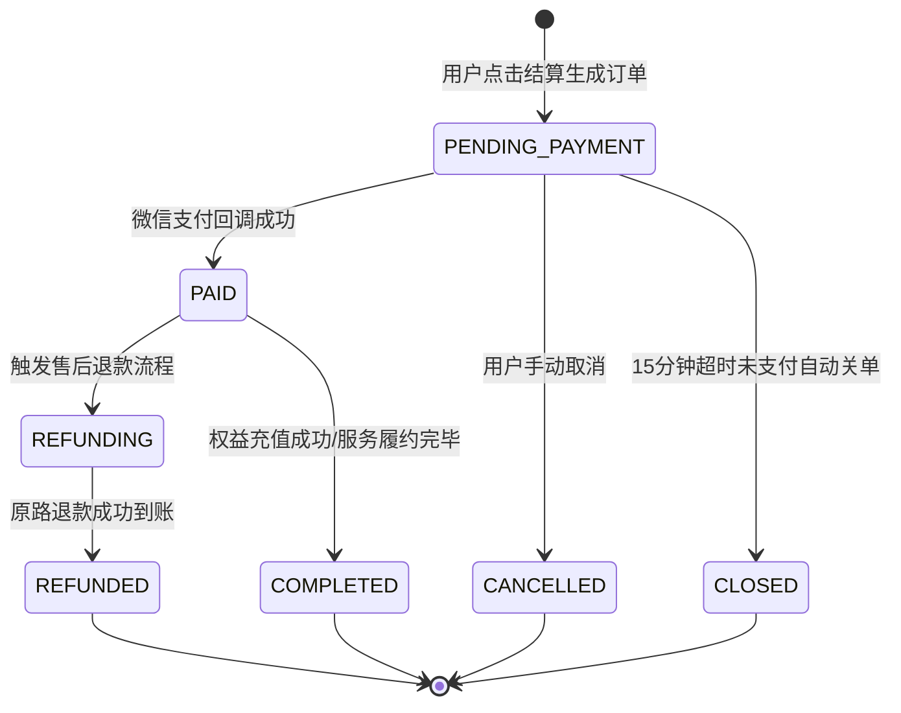
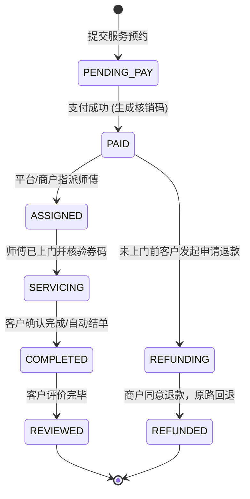
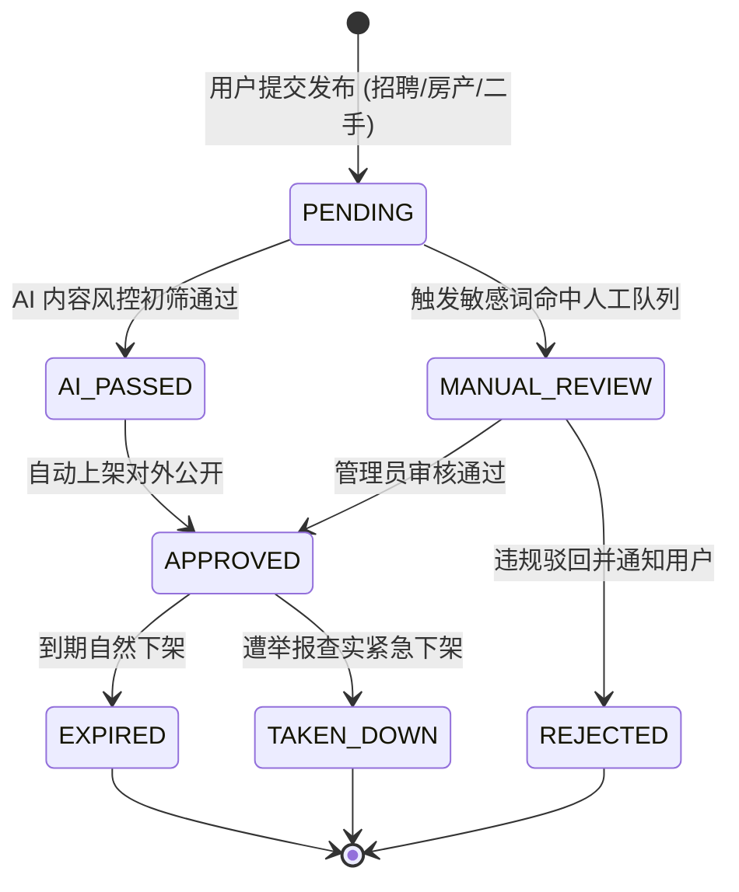
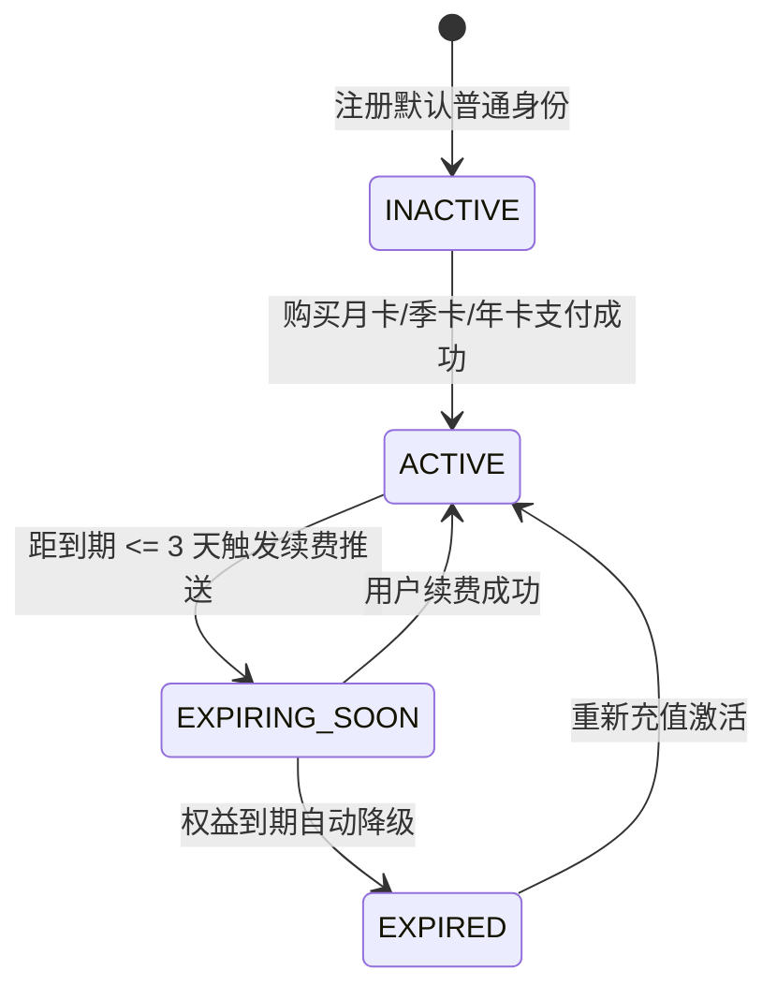
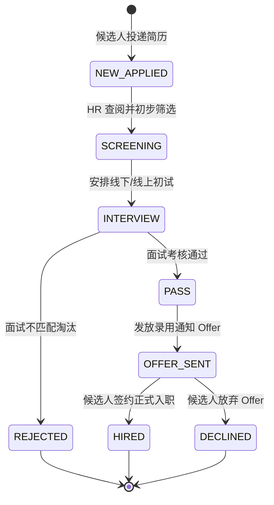
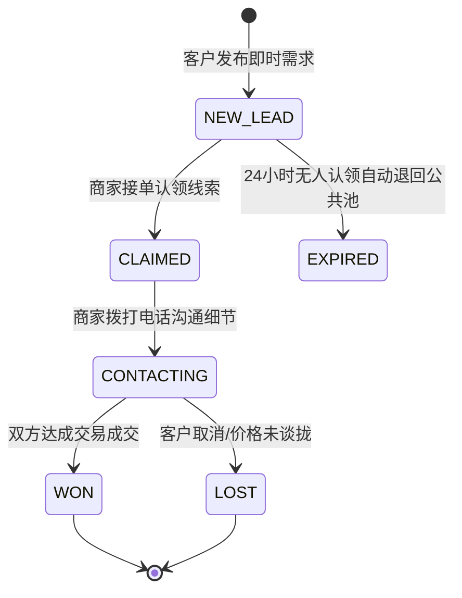

# 杨林生活网 (iyanglin.com) 业务状态机设计手册

## 1. 状态机总则与流转原则

状态机是系统保持“数据一致性、流程严密性、资金安全性”的基石。杨林生活网全站遵循以下规范：
1. **单一输入源原则**：状态变更只能通过受信任的服务端业务事件驱动，不可跨状态随意跳转；
2. **幂等性防护**：重复触发相同事件时，保持最终状态不变，不重复扣费、不重复履约；
3. **不可逆交易**：一旦进入终态 (`COMPLETED`, `REFUNDED`, `CLOSED`)，绝对不可回滚到活动态。

---

## 2. 六大核心业务状态机模型

### (1) 商业订单状态机 (`BillingOrder.status`)

### (2) 履约服务订单状态机 (`ServiceOrder.status`)

### (3) 内容发布与多级审核状态机 (`ContentStatus`)

### (4) 会员 VIP 权益生命周期状态机

### (5) 招聘 ATS 候选人应聘流转状态机

### (6) 商业获客线索跟进状态机 (`ServiceLead.status`)

---

## 3. 状态异常自愈与防御机制

1. **分布式并发锁**：状态更新使用乐观锁版本控制或基于数据库事务 (`prisma.$transaction`)，杜绝双发并发调用；
2. **定时对账巡检**：
   - 订单关闭定时器：每分钟扫描 `status = PENDING_PAYMENT` 且 `createdAt < NOW() - 15 MIN`，自动安全流转为 `CLOSED`；
   - 置顶过期定时器：每小时扫描 `pinnedUntil < NOW()`，自动撤除置顶标牌。
