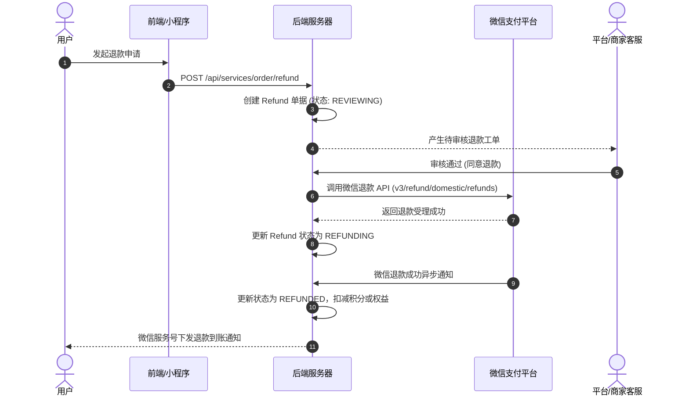

# 杨林生活网 (iyanglin.com) 支付与退款系统说明手册

## 1. 支付系统架构与支付渠道

杨林生活网接入微信支付官方商户直连体系，支持全场景主流交互模式：

| 支付模式 | 适用终端 | 调起交互流程 |
| :--- | :--- | :--- |
| **微信 Native 扫码** | PC 电脑端浏览器 | 统一下单生成 `code_url`，前端使用 QRCode 渲染二维码，用户打开手机微信扫码支付 |
| **微信 JSAPI** | 微信内浏览器 (H5/服务号) | 通过 OAuth2 获取用户 `openid`，调起微信内原生安全支付键盘 (`WeixinJSBridge.invoke`) |
| **微信 H5 支付** | 手机外部普通浏览器 | 统一下单生成 `mweb_url`，唤醒手机已安装的微信 App 快速付款 |
| **微信小程序支付** | 微信小程序端 | 通过 `wx.login` 获取的小程序 `openid` 调起原生 `wx.requestPayment` 接口 |

---

## 2. 资金安全核心防护机制

### (1) 金额绝对由服务端计算（防抓包篡改）
- **违规做法**：前端提交支付金额参数（如 `{ amount: 0.01 }`），极易被代理抓包篡改。
- **本系统铁律**：
  ```
  [用户选购] -> 前端传参: { planId: "vip-quarter", couponId: "cp-10off" }
                     |
                     v
  [服务端计算] -> 查询套餐原价: 19900分
                  校验优惠券减免: -2000分
                  最终计算实付: 17900分 (入库 BillingOrder.amountCents)
                     |
                     v
  [向微信统一下单] -> 上送 total_fee: 17900 分
  ```
  前端绝无干预交易金额的能力。

### (2) 微信 Webhook 回调幂等去重
- 微信服务器可能因网络波动多次下发同一笔订单的扣款通知；
- 系统在处理 Webhook 时通过唯一约束防重：
  1. 开启数据库事务；
  2. 检查当前订单 `status`，若已为 `PAID`，直接返回成功 XML/JSON，避免重复履约；
  3. 若状态为 `PENDING_PAYMENT`，更新状态为 `PAID`，记录微信交易流水号 (`transactionId`)，执行发放权益与积分；
  4. 提交事务并向微信响应 `SUCCESS`。

---

## 3. 异常掉单主动核验与补偿机制

针对用户已付款但因手机断网或微信回调延迟导致的“未即时到账”场景，系统具备三级防线：

1. **前端长轮询感知**：收银台页面每 2 秒轮询 `/api/billing/order/:id` 状态，一旦服务端收到回调立即跳转成功页；
2. **用户一键主动查单**：收银台提供「已完成支付？点击刷新状态」按钮，触发 `/api/billing/verify` 接口，服务端主动调用微信官方 `OrderQuery` API，查实已付款则立即自动补单；
3. **后台定时任务兜底**：后台定时脚本每 5 分钟扫描过去 1 小时处于 `PENDING_PAYMENT` 的订单，逐笔向微信接口发起状态校对，杜绝漏单。

---

## 4. 退款与逆向交易流程

### 退款原则
1. **原路退回**：资金必须原路退回到用户原扣款账户（零钱或银行卡），不可线下私自转账退款；
2. **严禁物理删除**：退款必须生成独立的 `Refund` 单据，保留关联的 `BillingOrder` 或 `ServiceOrder`；
3. **退款时限**：支持在交易完成后 30 天内按售后规则发起退款。

### 退款处理流转图


---

## 5. 商户结算分账与财务对账

- **资金结算周期**：针对入驻商户或服务师傅，提供 T+1 或 T+7 周期结算模式；
- **佣金比例**：平台抽成比例由系统参数配置（默认 5%）；
- **对账单拉取**：每日凌晨 04:00 自动拉取微信官方前一日资金账单，比对系统流水，自动生成日对账平衡报表。
