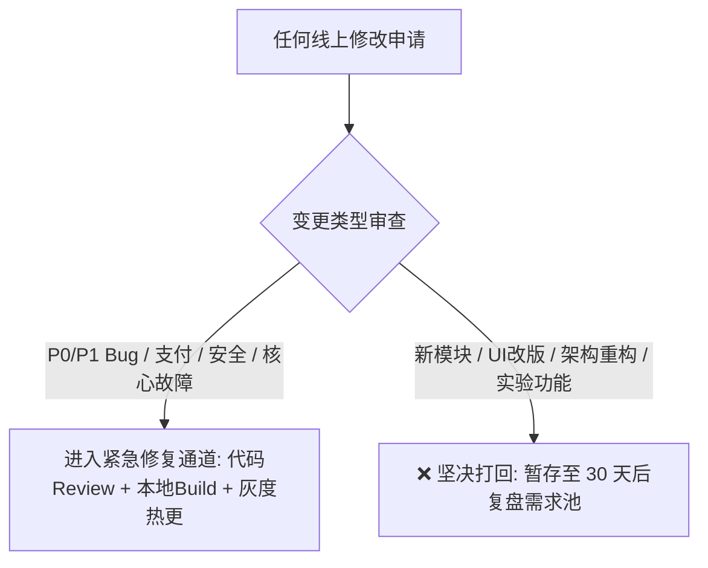
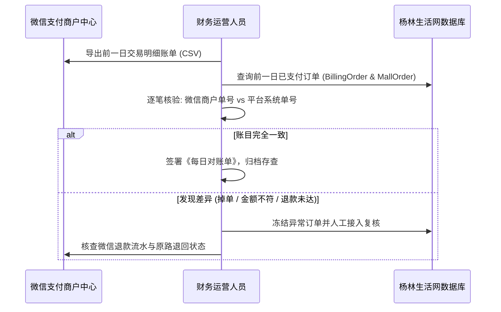
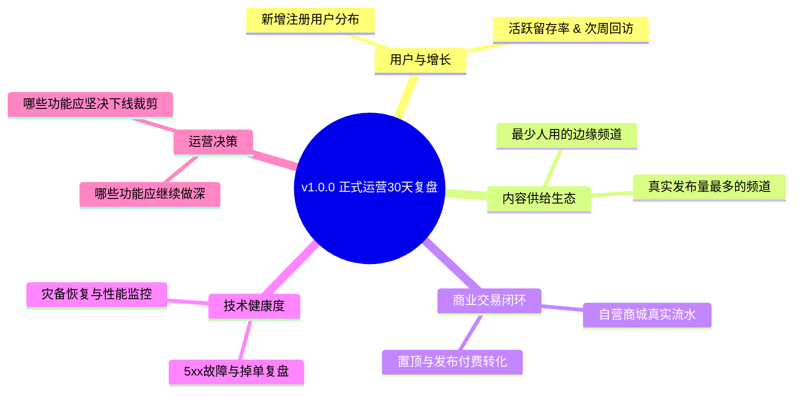

# 《杨林生活网 v1.0.0 正式运营期运维与管控手册》

> **项目代号**：杨林生活网 (iyanglin.com)  
> **生效版本**：`v1.0.0` (Production Release)  
> **生效日期**：2026年9月18日  
> **适用周期**：正式上线运营阶段及首个“30天功能冻结与运营观察期”  
> **核心原则**：停止盲目开发，严禁伪造数据；以真实用户、真实商户、真实交易为中心，保障系统安全、稳定与资金合规。

---

## 目录索引

1. [正式运营版本基准锚点](#1-正式运营版本基准锚点)
2. [30天功能冻结管理规范](#2-30天功能冻结管理规范)
3. [每日运营指标巡检制度 (19项)](#3-每日运营指标巡检制度)
4. [每日支付与资金对账 SOP](#4-每日支付与资金对账-sop)
5. [财务人工退款处置规程 (微信商户平台兜底)](#5-财务人工退款处置规程)
6. [技术演进优先级路线图 (P1 / P2)](#6-技术演进优先级路线图)
7. [每周数据真实性核查机制 (反作弊红线)](#7-每周数据真实性核查机制)
8. [每周灾难恢复抽查演练制度](#8-每周灾难恢复抽查演练制度)
9. [运营观察期 30 天复盘评估框架](#9-运营观察期-30-天复盘评估框架)

---

## 1. 正式运营版本基准锚点

以下元数据构成杨林生活网 `v1.0.0` 正式上线的不可篡改基准锚点：

| 维度 | 基准参数 | 验证状态与位置 |
| :--- | :--- | :--- |
| **版本号 (Version)** | `v1.0.0` | `package.json` (`"version": "1.0.0"`) |
| **Git Commit** | `e5fa066de5ad20a7e85ea47fc36b39bd6e473130` | 本地与生产代码库一致 |
| **Git Release Tag** | `v1.0.0` | 带有 Release v1.0.0 注解的正式标签 |
| **Next.js 生产构建时间** | `2026-09-18 20:35:27 CST` | `/var/www/iyanglin.com/.next` |
| **Next.js 生产 Build ID** | `U-9thdCpWLyK_41WD_sxE` | `/var/www/iyanglin.com/.next/BUILD_ID` |
| **Node.js 运行时** | `v22.22.1 LTS` | 生产宿主 Node 环境 |
| **PM2 守护进程** | `6.0.14` (进程 #10 `yanglinol-newsite`) | 运行目录 `/var/www/iyanglin.com`，内存约 413MB |
| **PostgreSQL 数据库** | `PostgreSQL 15.17` (Docker: `vasto-postgres`) | 131 张公共业务表，Prisma ORM 6.16.0 |
| **Nginx 反向代理** | `1.18.0 (Ubuntu)` | 端口 443 反代 3006，HTTP/2 开启，SSL 有效至 2026-11-20 |

---

## 2. 30天功能冻结管理规范

为了确保 `v1.0.0` 上线后的生产稳定，杜绝频繁变更引入未知 Bug，**自 2026年9月18日起至 2026年10月18日 执行严格的 30 天功能冻结期**。

### 2.1 允许修改的范围 (白名单)
1. **🔴 P0 / 🟠 P1 缺陷**：服务崩溃、数据写入中断、页面白屏；
2. **微信支付与资金安全**：支付掉单、金额不一致、退款流转阻塞；
3. **越权与安全漏洞**：身份伪造、IDOR 越权、SQL/XSS 注入隐患；
4. **法律与监管合规**：违规违法信息过滤、ICP/网安合规政策调整；
5. **数据错误纠正**：因系统 Bug 导致的脏数据修正（需留存修复日志）；
6. **影响用户使用的核心功能阻断**：如无法登录、无法拨打招聘电话、无法发布合规帖子。

### 2.2 严禁修改的范围 (黑名单)
1. ❌ **严禁新增大型业务频道或模块**（如二手车、直播电商、复杂问卷等）；
2. ❌ **严禁底层架构重构**（如更换 ORM、更换状态机、推翻 API 路由）；
3. ❌ **严禁 P9 / P10 概念性或实验性功能**；
4. ❌ **严禁非必要的 UI 主题或视觉大改**；
5. ❌ **严禁为了虚假繁荣注入任何伪造数据**。

---

## 3. 每日运营指标巡检制度

运维与运营负责人必须在**每日上午 09:30 前**完成前一日数据的巡检与登记，形成《每日运营巡检日志》。

### 3.1 核心巡检 19 项指标清单

| 分类 | 巡检指标项 | 采集来源 / 查询指令 | 预警阈值 | 负责人 |
| :--- | :--- | :--- | :--- | :--- |
| **流量与活跃** | 1. 独立访客数 (UV) | Nginx access.log 独立 IP 统计 | 跌幅 > 40% 需复核原因 | 运营主管 |
| | 2. 日活跃用户 (DAU) | `User.lastActiveAt` 前日去重计数 | 跌幅 > 30% | 运营主管 |
| | 3. 新增注册用户数 | `User.createdAt >= 昨日00:00` | 连续 3 天为 0 需检查注册通道 | 运营主管 |
| **内容与供给** | 4. 新增内容发布数 | 招聘、房产、招商、便民发帖总量 | 异常激增需排查发帖机 | 内容审核员 |
| | 5. 待审核内容数量 | 状态为 `PENDING` 的全站内容总和 | 待审积压 > 20 条需超时催办 | 内容审核员 |
| **支付与交易** | 6. 支付订单总数 | `BillingOrder` + `MallOrder` 成功数 | 无 | 财务主管 |
| | 7. 实际到账总金额 | 微信商户平台入账流水总计 (元) | 金额与本地订单核对 | 财务主管 |
| | 8. 支付失败笔数 | 微信预下单失败或取消订单数 | 失败率 > 15% 需查支付链路 | 技术研发 |
| | 9. 掉单/未回调数 | 微信已扣款但系统未变 PAID 订单数 | **> 0 笔即触发报警 (P0)** | 技术研发 |
| | 10. 售后退款笔数 | 当日申请及完成的退款总单数 | 异常集中退款需查商品质量 | 财务主管 |
| **履约与售后** | 11. 自营便利店订单数 | `MallOrder.status == 'PAID'` | 无 | 店长 |
| | 12. 配送与自提异常 | 超过 2 小时未完成配送/自提异常 | > 2 笔需联系客户沟通 | 店长 |
| **治理与服务** | 13. 用户违规举报数 | `Report.status == 'PENDING'` | 未处理 > 5 条需立即清理 | 客服主管 |
| | 14. 用户客诉/纠纷数 | 客服微信/电话登记的投诉事件 | 当日必须 100% 响应闭环 | 客服主管 |
| **AI 助手** | 15. AI 助手总请求量 | `ChatMessage` 当日调用条数 | 激增 10 倍以上排查被刷 Token | 技术研发 |
| | 16. AI 零结果/兜底率 | 返回“未找到匹配信息”的比例 | 兜底率 > 30% 需补齐知识库 | 运营主管 |
| **系统稳定性** | 17. 500 / 502 错误率 | Nginx 日志中 HTTP 5xx 状态码占比 | **> 0.1% 立即排查 PM2** | 技术研发 |
| | 18. 生产磁盘可用空间 | `df -h /dev/vda2` 剩余容量 | 可用空间 < 15GB 报警 | 运维人员 |
| | 19. 备份文件健康状态 | `/var/backups/yanglin_db` 最新备份大小 | 备份大小 < 1MB 报警 | 运维人员 |

---

## 4. 每日支付与资金对账 SOP

为了杜绝资金错漏、虚假入账与财务风险，**每日 10:00 前由财务人员协同运维执行“五步双向对账法”**。

### 4.1 对账操作步骤
1. **导出微信商户账单**：登录 `pay.weixin.qq.com` -> 交易中心 -> 账单管理，下载前一日【资金账单】与【交易账单】；
2. **导出平台数据库账单**：
   - 提取 `BillingOrder` (商业发布置顶)：`where: { status: 'PAID', paidAt: [T-1日] }`；
   - 提取 `MallOrder` (自营便利店)：`where: { status: 'PAID', paidAt: [T-1日] }`；
3. **比对四大关键要素**：
   - 微信支付订单号 (`transaction_id`)；
   - 商户订单号 (`out_trade_no`)；
   - 交易实付金额（单位：分/元）；
   - 最终交易状态（支付成功 / 已退款）。
4. **差异处理机制**：
   - **单边账（微信有、平台无）**：通常为回调瞬间网络超时未投递。技术人员核验微信流水号后，调用补单接口将订单恢复为 `PAID` 并记录审计日志；
   - **单边账（平台有、微信无）**：严密排查是否存在前端篡改伪造凭据，立即冻结对应权限与商品发货，向技术部门提报 P0 审查；
   - **金额不一致**：立即冻结订单，排查是否存在折扣算价逻辑异常。

---

## 5. 财务人工退款处置规程

在服务端调用微信支付全自动退款 API 经过完整自动化测试验证之前，**商城与服务的退款一律执行严格的《财务人工退款 SOP》，严禁脱离平台私下给用户微信转账**。

### 5.1 退款处理流程
1. **用户申请**：用户在个人中心发起售后退款，提交退款原因与凭据；
2. **运营后台初审**：
   - 客服/运营人员在后台核实用户退款诉求（如商品缺货、送达超时、未到店核销）；
   - 核实无误后，在运营后台点击【同意退款】；
   - **注意**：此时系统订单状态变更为 `REFUNDED`，库存自动回滚，但资金尚未原路退回！
3. **微信商户平台执行原路退款 (核心步骤)**：
   - 财务人员接单后（2 小时内），登录微信支付商户平台 `pay.weixin.qq.com`；
   - 进入【交易中心】->【交易账单】，输入该订单对应的 `out_trade_no` 或 `transaction_id`；
   - 确认原订单金额，点击【退款】，输入退款金额与退款原因，使用商户操作员证书或扫码确认；
4. **结果回填与归档**：
   - 确认微信商户后台提示“退款成功”，并在对应平台订单日志中备注：“微信退款流水号：xxx，操作人：财务某某”。

---

## 6. 技术演进优先级路线图

在 30 天功能冻结期内，开发团队的工作重点转移为**提升稳定性、自动化防线与底层治理**，技术演进按以下优先级分步推进：

### 🟠 P1 级别（核心资金与账号安全，冻结期优先推进）
1. **微信原路退款 API 自动化接入**：
   - 在开发环境调通微信支付 V3 退款接口证书验签，完成端到端自动化退款测试，逐步替换人工退款 SOP；
2. **手机号与微信账号合并绑定**：
   - 优化前端登录拦截器，当微信登录用户未绑定手机时，在进入用户中心或发帖时轻量弹出“关联手机号”；
3. **核心端点 IP 频控（Rate Limit）全覆盖**：
   - 为 `/api/auth/login`（防暴力破解）与 `/api/ai/assistant`（防恶意消耗 Token）接入成熟的单 IP 限流机制。

### 🟡 P2 级别（内容治理与性能提升）
1. **园区招商发帖流程统一**：将 `/api/industrial` 由现行的“先发后审”改版为与其他频道一致的“先审后发”，杜绝夜间违规垃圾信息；
2. **管理员权限角色细化拆分**：在 Prisma Schema 中将 `Role.ADMIN` 细分为 `FINANCE`（财务专用）与 `CONTENT_AUDITOR`（审核专用）；
3. **重型页面服务端性能调优**：对聚合了 10 个频道的首页 (`/`)、求职页面 (`/jobs`) 与社区 (`/community`) 增加内存级轻量查询缓存或索引微调，降低 P50 延迟。

---

## 7. 每周数据真实性核查机制

平台坚守“真实本地生活网”定位，**严禁任何形式的自欺欺人与虚假繁荣**。技术与运营每周五下午执行数据真实性全盘扫描：

### 7.1 六大严禁“造假红线”
1. 🚫 **严禁伪造虚假销量**：自营商城商品的销量字段必须由真实付款订单关联累加，严禁手动在数据库随意改大销量；
2. 🚫 **严禁虚假浏览量刷量**：浏览计数器必须基于真实客户端访问触发，严禁使用自动化定时脚本批量递增 views；
3. 🚫 **严禁伪造企业认证**：企业主体认证必须具备真实营业执照或授权书影像凭证，未核验材料严禁挂上“已认证”企业标牌；
4. 🚫 **严禁虚假评分与好评**：商家与商品的评价必须来源于真实下单/消费过的用户账号，严禁管理员自编自导好评；
5. 🚫 **严禁虚构实时数据**：严禁在前端编写随机假滚动的“某某用户刚刚发布了求职/下单了商品”欺骗性滚动条；
6. 🚫 **严禁虚构成功案例**：园区招商与大宗租售案例必须真实存在。

---

## 8. 每周灾难恢复抽查演练制度

为了防止“备份文件看似存在，实际损坏无法解压”的悲剧，运维人员**每周必须对自动化备份进行一次抽查验证**。

### 8.1 周度抽测操作规程
1. **确认每日备份状态**：
   - 检查 `/var/backups/yanglin_db/` 目录下最近 7 天的 `.sql.gz` 备份文件，确认文件体积稳定在 2.4MB 以上且每日凌晨 03:00 准时生成；
2. **执行恢复抽查演练（不可在生产库直接测试）**：
   - 运行前期固化的自动化演练脚本 `scratch/pg_restore_drill.py`；
   - 在 Docker 实例中创建临时测试数据库 `test_restore_drill`，将最新的备份文件导入该临时库；
   - 记录演练 RTO（恢复耗时），确保 RTO <= 10 秒；
   - 校验临时库的表总数（必须为 131 张）及核心表记录数；
   - 演练结束后立即 `DROP DATABASE test_restore_drill;` 释放资源。

---

## 9. 运营观察期 30 天复盘评估框架

在正式运营第 30 天（即 **2026年10月18日**），团队将关闭“功能冻结期”，并输出系统的《杨林生活网正式运营30天复盘报告》，重点复盘以下 11 个业务与技术维度：

1. **用户增长与真实画像**：30 天累计新增真实用户数、手机验证比例、微信绑定比例；
2. **活跃度与用户留存**：首批种子用户次周与次月留存率，平均使用频次；
3. **内容供给生态**：求职、房产、本地便民等频道的实际发帖质量与活跃度；
4. **真实交易与营收**：自营商城流水、商业置顶收费总额、平均客单价；
5. **履约质量**：自营便利店自提核销率、同城配送平均耗时、用户满意度；
6. **AI 助手实际效能**：本地咨询解决率、高频提问关键词聚类、AI 召回准确率；
7. **客诉与安全事件**：违规内容拦截情况、退款纠纷处理时效；
8. **系统稳定性总结**：生产机器 CPU/内存占用曲线、公网错误率、PM2 崩溃次数；
9. **最受欢迎功能 TOP 3**：用户高频停留与产生实际价值的模块；
10. **最少使用功能 BOTTOM 3**：数据证明无人问津、应当考虑裁剪的冗余功能；
11. **下一阶段产品路线图**：基于 30 天真实运营数据，决定是否启动特定新功能的研发，或继续聚焦本地内容深耕。

---

**签署确认**：  
杨林生活网产品与技术运营委员会  
2026年9月18日
